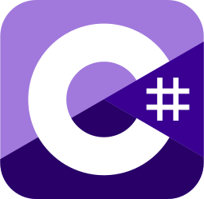
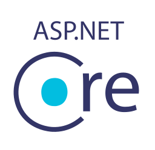
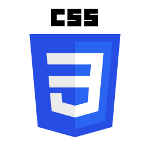
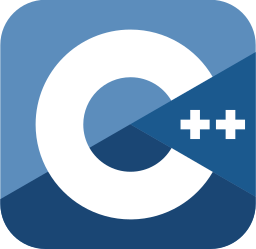
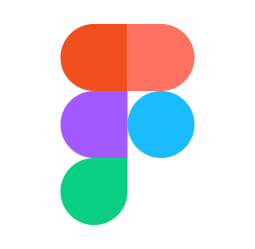
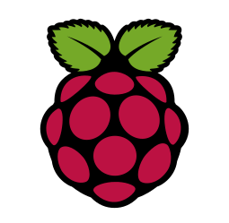
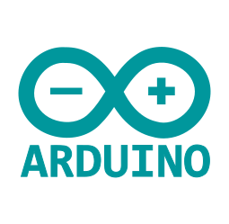

    

# Hi there, I'm Rawfin.

🎓 Graduate student pursuing an MSc in Software Engineering  
💻 Enthusiastic about programming and UI/UX design  
🧠 Fluent in C#, SQL, JavaScript, and CSS  
🚀 Dedicated to improving programming skills every day  

## Toolbox

&nbsp;
&nbsp;
&nbsp;
&nbsp;
&nbsp;
&nbsp;
&nbsp;
&nbsp;
&nbsp;
&nbsp;
&nbsp;
&nbsp;
&nbsp;
&nbsp;
&nbsp;

&nbsp;
&nbsp;
&nbsp;
&nbsp;
&nbsp;
&nbsp;
&nbsp;
&nbsp;
&nbsp;
&nbsp;
&nbsp;

## GitHub Stats

  
  
  

## Reach Me

🌐 **Website:** [rawfin.net](https://rawfin.net)  
✉️ **Email:** hello@rawfin.net or zrawfin@gmail.com  
💼 **LinkedIn:** [in/Rawfin](https://linkedin.com/in/Rawfin)  
📺 **YouTube:** [@OsthirFin](https://www.youtube.com/@OsthirFin)  
💬 **Discord:** `OsthirFin`  
🐦 **X:** [@zRawfin](https://twitter.com/zRawfin)
